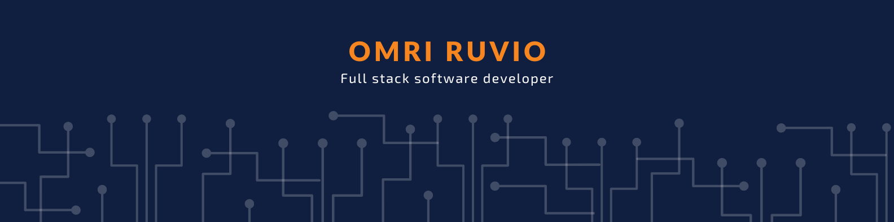
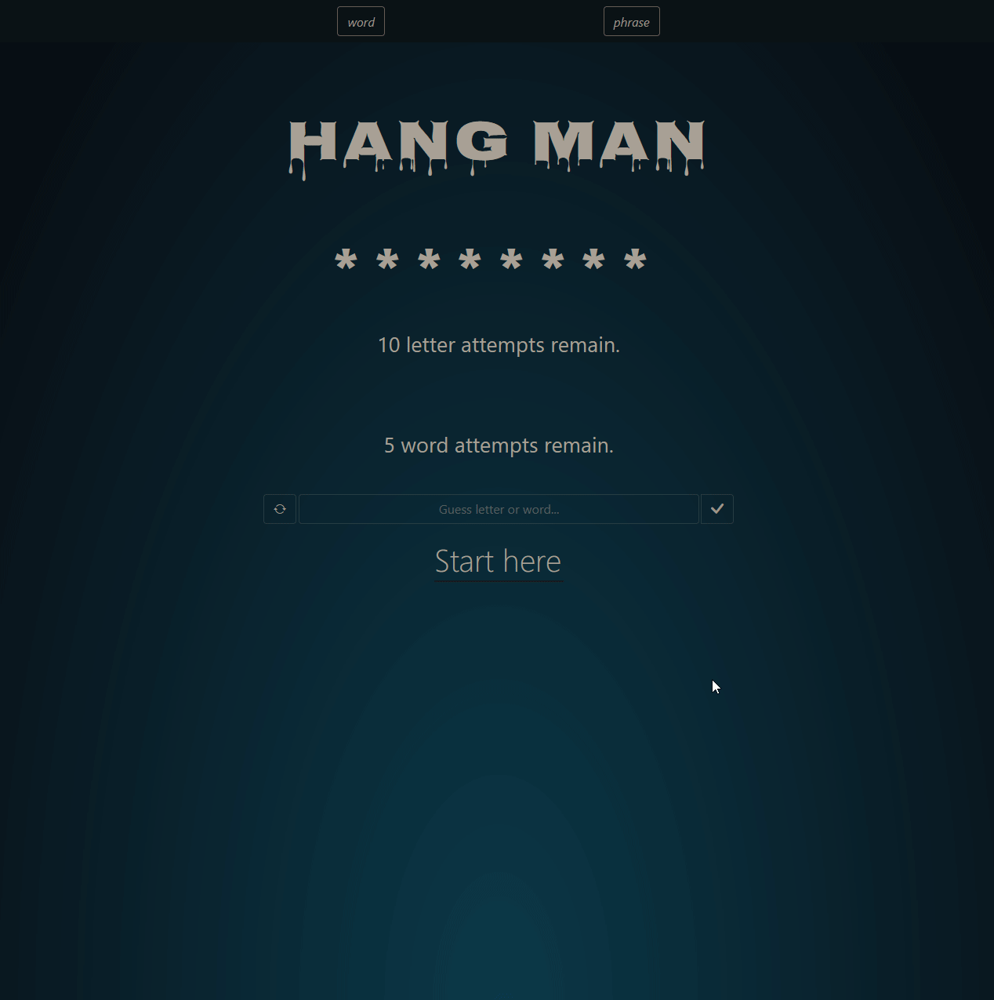

  
  
  
  

👋 Hi, I’m Omri Ruvio.

🧑‍💻 Co-Founder/CEO & Full-Stack Software Engineer @ CyberGames.

📫 Reach me on twitter [@omriruvio](omriruvio.com/twitter).

💼 Contact me on [linkedin](omriruvio.com/linkedin).

Visit [my website](https://omriruvio.com) for more information!

<h1 align="center">Projects</h1>
<table bordercolor="#66b2b2">
  
  <tr>
    <td width="50%" valign="top">
      <h3 align="center">Hydroponics</h3>
       
        
       
        

  
  
      

        
E2E Application taking Whatsapp provided user input, parsing & storing crop data, and providing both Whatsapp based outputs & web based dashboards. <strong>Built with React, Next.js, Node.js, MongoDB & Twilio</strong>

  </td>
    <td width="50%" valign="top">
      <h3 align="center">News Explorer</h3>
         
        
         
        

          
    
  
      

        
Search, browse and sign up to bookmark your favorite news articles for later reading.
        <strong>Web app built with React, Node & MongoDB.</strong>

    </td>
  </tr>
  
  <tr>
    <td width="50%" valign="top">
      <h3 align="center">CyberGames Landing Page</h3>
       
        
       
        

  
  
      

        
A website made for CyberGames startup, introducing a cyber security training platform based on an online multiplayer game. <strong>Built with vanilla HTML, CSS & JS.</strong>

    </td>
   </td>
    <td width="50%" valign="top">
      <h3 align="center">Around the US</h3>
         
      
         
        

          
  
  
      

        
Instagram-like image sharing web application. User management system, API powered server side persistence, profile editing, liking, adding and deleting posts functionalities. <strong>Web App built with React, Node & MongoDB.</strong>

    </td>
  </tr>

  <!-- <tr>
    <td width="50%" valign="top">
      <h3 align="center">Hydroponics</h3>
       
        
       
        

  
  
      

        
E2E Application taking Whatsapp provided user input, parsing & storing crop data, and providing both Whatsapp based outputs & web based dashboards. <strong>Built with React, Next.js, Node.js, MongoDB & Twilio</strong>

  </td> 
  <td width="50%" valign="top">
  <h3 align="center">Hangman</h3>
     
    
    

  
  
    

      
The famous word guessing game, <strong>Built with HTML, CSS, JS, anime.js, jquery and bootstrap libraries.</strong> 

  </td> 
  
  </tr> -->
</table>

<h1 align="center">Technologies</h1>

    
    
    
    
    
    
    
    
    

---

<h1 align="center">Contact info</h1>

  
  
  
  

